# 🕹️RaspiCore™ Deck
RaspiCore™ Deck is a portable emulation device supporting popular emulators like Duck Station, AetherSX2, Dolphin.
# ⚙️Overview
RaspiCore™ Deck is a high-performance handheld emulation console built around an overclocked Raspberry Pi 5, designed to deliver smooth gameplay across multiple classic and modern platforms.

The device features a custom DIY power bank capable of supplying up to 8 amps, ensuring stable performance even under heavy load and extended gaming sessions.

Running on a lightweight 64-bit Raspberry Pi OS Bookworm Lite with RetroPie installed, the system provides a flexible and customizable environment for emulation, allowing users to run a wide range of classic consoles through optimized third-party emulators.
## Why I decided to make this
For 2 years from now I'm interested in electric engineering, and in that time I made lots of small electrionic pcbs and devices. But I wanted to build something original and better than this 30 minutes pcb projects, so i decide to give a try building a handheld console using raspberry pi 5 and named it _RaspiCore™ Deck._
## 📐 CAD Design
### Power Bank's case
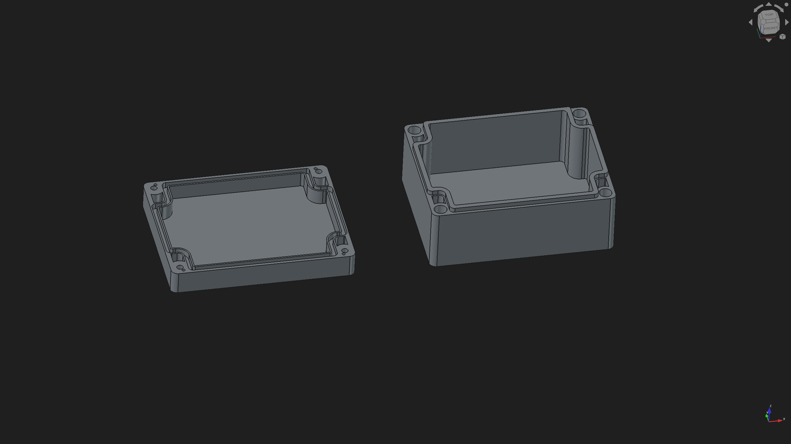

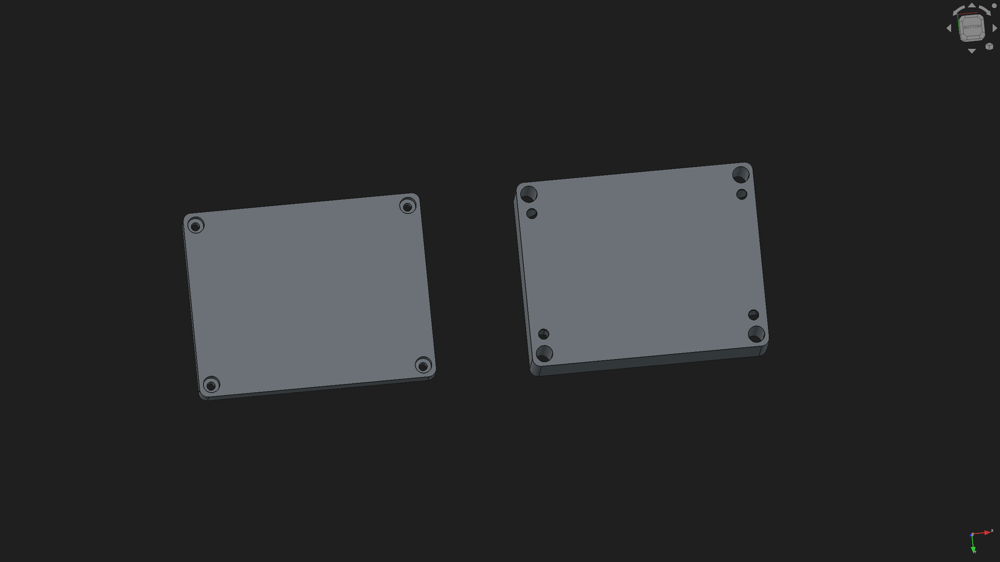

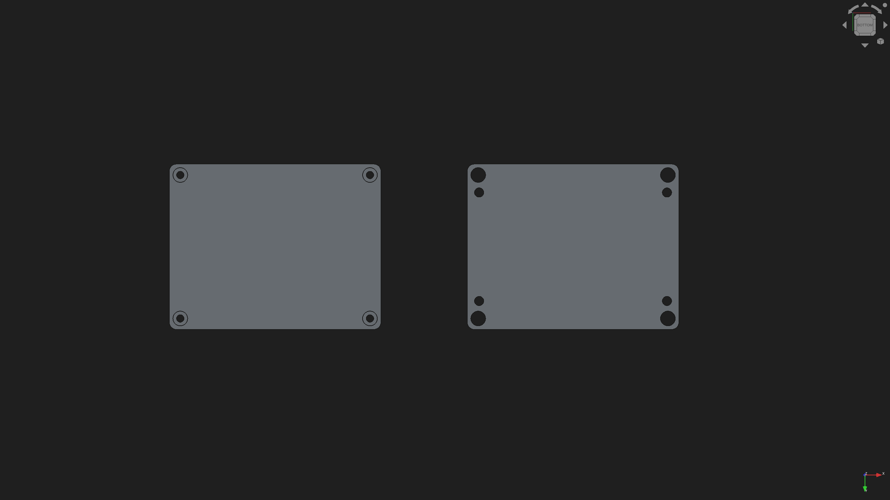

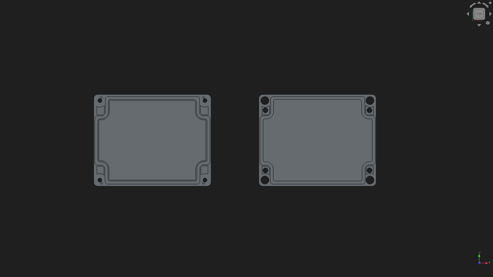

### Power Bank
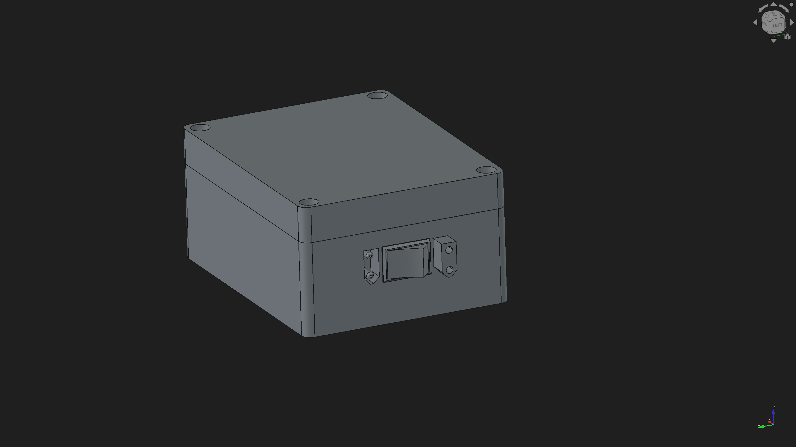

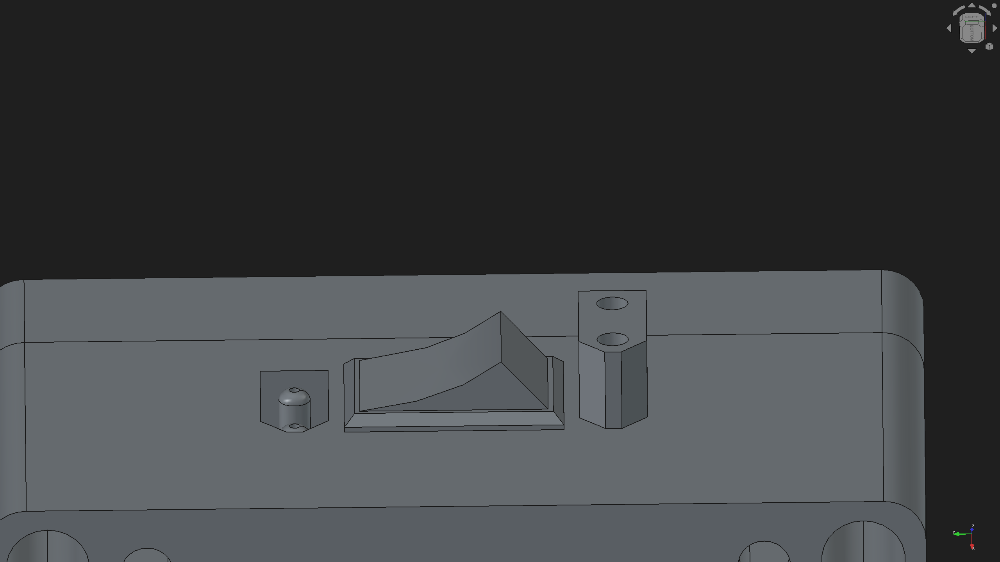

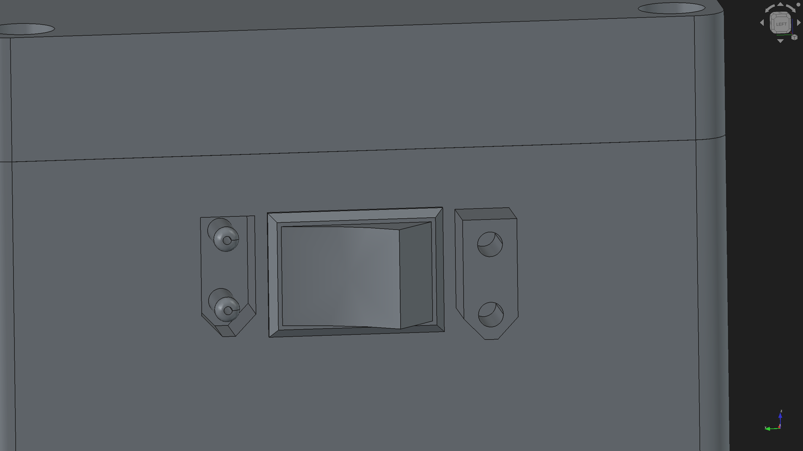

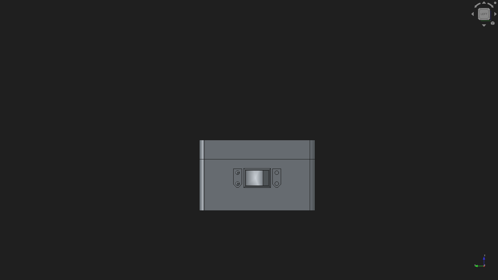

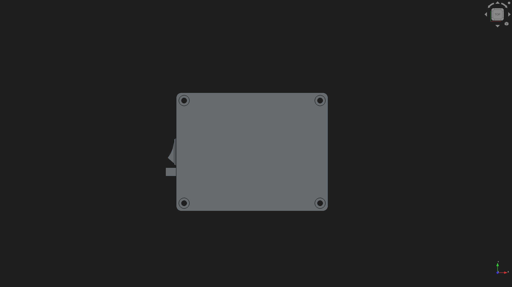
### Console
Nothing here (for now).
## 📸 Photos
### Power Bank
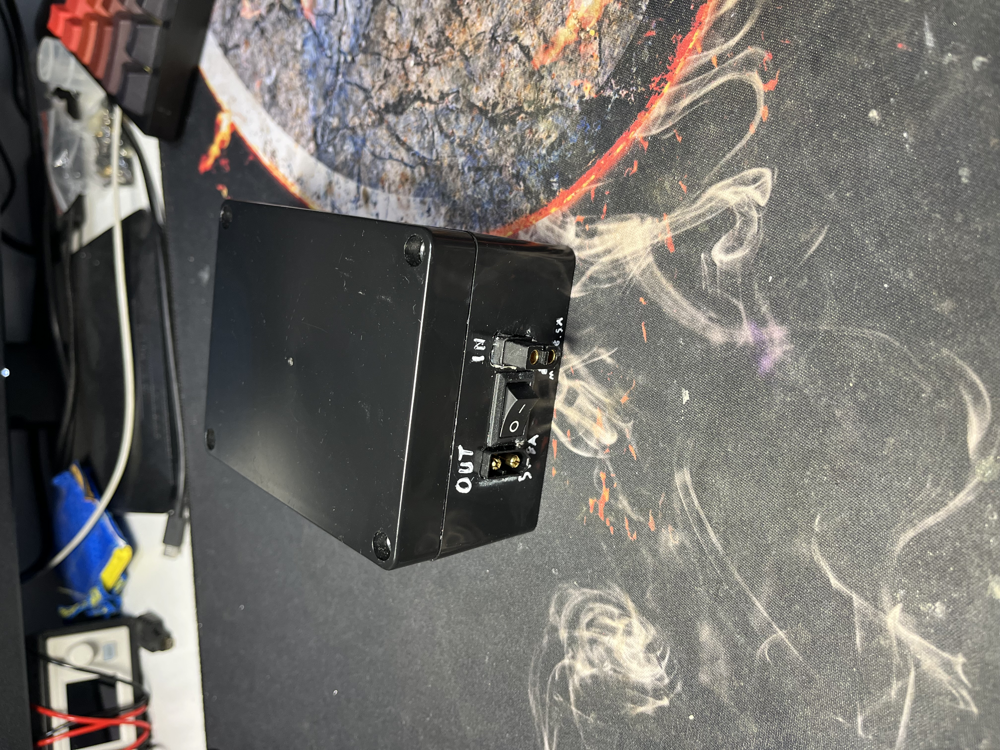

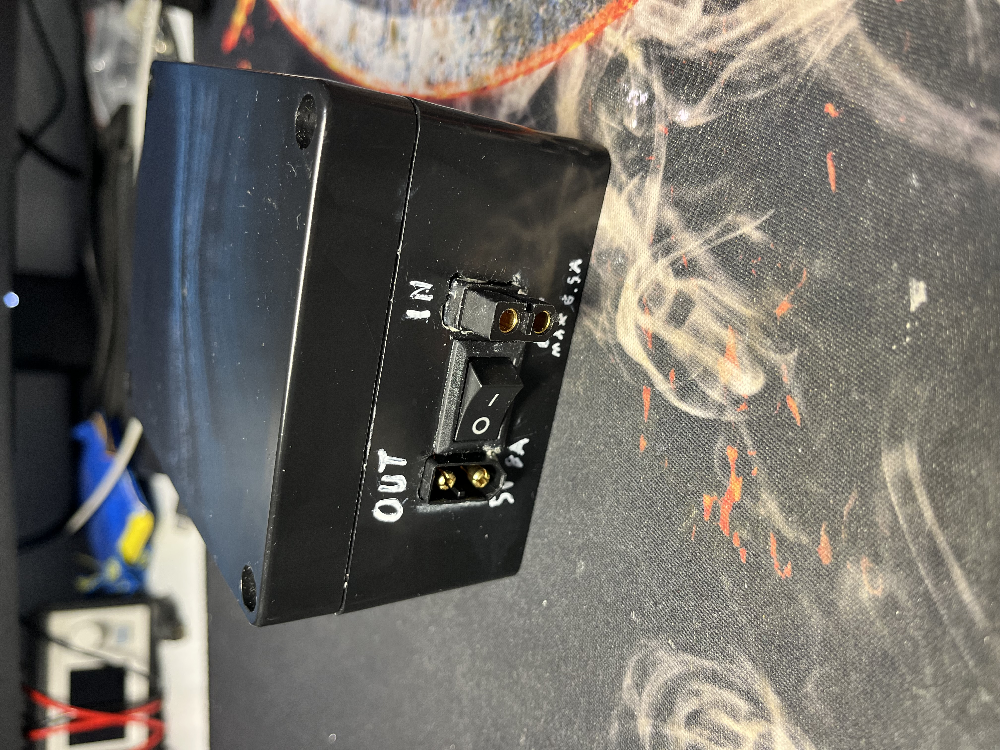

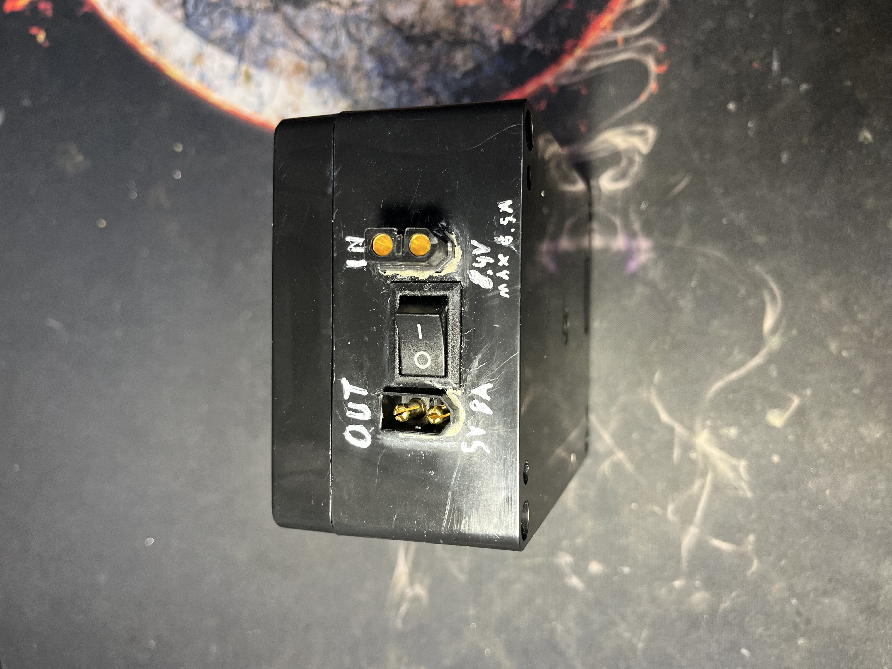

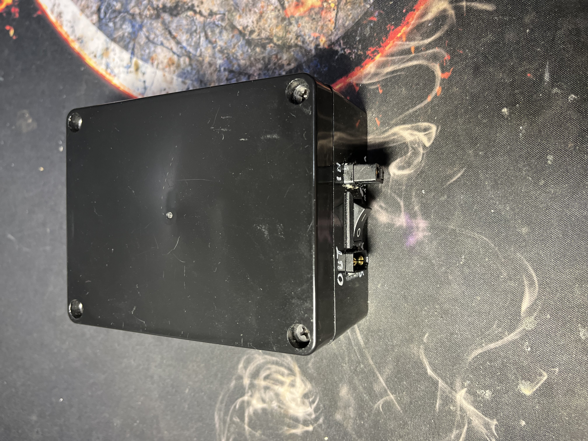
### Console
Nothing here (for now)
## 📋Bill of Materials:
| Name | Purpose | Quanity | Price | Link | Distributor |
|------|---------|---------|-------|------|-------------|
| On-Off switch (For power bank)| On-Off switch used to turn On/Off the power bank.(The listed price is for 5 pieces but only 1 piece is used.) | 1 | $1.13 | [Link](https://pl.aliexpress.com/item/1005007945027854.html?spm=a2g0o.order_list.order_list_main.265.f8191c24WFr5Z1&gatewayAdapt=glo2pol) | AliExpress |
| 5" HDMI LCD Screen | Screen used in project that display an image that Raspberry Pi send. | 1 | 	$29.98 | [Link](https://pl.aliexpress.com/item/1005010109611551.html?invitationCode=blNIVFRPQkdaUUNlNzJGdU0zR3V2ZWtqQlFjcE5VWXdIVDFnQXlvTlgyNmVQemFTZUJrNWVWT0s1MU1hdTAyWg&srcSns=sns_More&sourceType=570&spreadType=socialShare&social_params=61495613854&bizType=ProductDetail&spreadCode=blNIVFRPQkdaUUNlNzJGdU0zR3V2ZWtqQlFjcE5VWXdIVDFnQXlvTlgyNmVQemFTZUJrNWVWT0s1MU1hdTAyWg&aff_fcid=296f3285a2904c65aeb7df8e6e9062f2-1777041186371-00344-_EJWZiny&tt=MG&aff_fsk=_EJWZiny&aff_platform=default&sk=_EJWZiny&aff_trace_key=296f3285a2904c65aeb7df8e6e9062f2-1777041186371-00344-_EJWZiny&shareId=61495613854&businessType=ProductDetail&platform=AE&terminal_id=44c74e92adf54435b6380e5544fad53c&afSmartRedirect=y) | AliExpress |
| Data Frog X3 controller | Controller used to play games on handheld. It is cut in half and 2 halves reconnected with cables that go through case. | 1 | $15.17 | [Link](https://pl.aliexpress.com/item/1005008450489185.html?spm=a2g0o.productlist.main.17.11164059J4QwCP&algo_pvid=842aaae0-d110-4cec-b02a-5e31f062f1cd&algo_exp_id=842aaae0-d110-4cec-b02a-5e31f062f1cd-16&pdp_ext_f=%7B%22order%22%3A%225554%22%2C%22spu_best_type%22%3A%22price%22%2C%22eval%22%3A%221%22%2C%22fromPage%22%3A%22search%22%7D&pdp_npi=6%40dis%21PLN%21166.50%2176.59%21%21%21305.84%21140.69%21%402103856417770407408726573e9cac%2112000050813401036%21sea%21PL%211862886205%21X%211%210%21n_tag%3A-29919%3Bd%3A4844e3ac%3Bm03_new_user%3A-29895&curPageLogUid=M5KPanUWP38V&utparam-url=scene%3Asearch%7Cquery_from%3A%7Cx_object_id%3A1005008450489185%7C_p_origin_prod%3A) | AliExpress |
| 2pcs MAX98357A audio module | Audio modules that connect to GPIO pins via I2c to play sound from speakers connected to the module. | 2 | $2.12 | [Link](https://pl.aliexpress.com/item/1005007068815767.html?spm=a2g0o.order_list.order_list_main.175.62091c24Y6q6XV&gatewayAdapt=glo2pol) | AliExpress |
| 8Ω 2W 28mm speaker | Speakers used in handheld for stereo audio. | 1 | $1.96 | [Link](https://pl.aliexpress.com/item/1005006056014552.html?spm=a2g0o.order_list.order_list_main.155.62091c24Y6q6XV&gatewayAdapt=glo2pol) | AliExpress |
| 3pcs XT60 Female connector | XT60 female connector for power bank to connect with console. | 2 | $1.49 | [Link](https://pl.aliexpress.com/item/1005003284732184.html?spm=a2g0o.order_list.order_list_main.151.62091c24Y6q6XV&gatewayAdapt=glo2pol) | AliExpress |
| 3pcs XT60 Male connector | XT60 connector for connecting power bank with handheld ,and for charging the power bank. | 2 | $1.49 | [Link](https://pl.aliexpress.com/item/1005003284732184.html?spm=a2g0o.order_list.order_list_main.151.62091c24Y6q6XV&gatewayAdapt=glo2pol) | AliExpress |
| 8pcs of 18650 3400mAh Li-ion batteries | Li-ion Batteries for power bank.They are 3400mAh each but when 2 sets of 4 batteries connected in parallel makes around 13600mAh (2s4p). | 1 | $18.79 | [Link](https://pl.aliexpress.com/item/32771532107.html?spm=a2g0o.order_list.order_list_main.145.62091c24Y6q6XV&gatewayAdapt=glo2pol) | AliExpress |
| 18650 Battery BMS | BMS for power bank so li-ion batteries can be safely charged and power the console.(The link for this item is not the same because they stopped selling that product so I put similar one.) | 1 | $1.53 | [Link](https://pl.aliexpress.com/item/1005006041712344.html?spm=a2g0o.productlist.main.2.c1a9BVMMBVMMJK&algo_pvid=524364e8-77b6-4439-a907-32922c035b73&algo_exp_id=524364e8-77b6-4439-a907-32922c035b73-1&pdp_ext_f=%7B%22order%22%3A%22286%22%2C%22spu_best_type%22%3A%22price%22%2C%22eval%22%3A%221%22%2C%22fromPage%22%3A%22search%22%7D&pdp_npi=6%40dis%21PLN%214.10%214.10%21%21%217.54%217.54%21%40211b431017770387570086100e1a3e%2112000035452608601%21sea%21PL%211862886205%21X%211%210%21n_tag%3A-29919%3Bd%3A4844e3ac%3Bm03_new_user%3A-29895&curPageLogUid=MxfnVB1KRywS&utparam-url=scene%3Asearch%7Cquery_from%3A%7Cx_object_id%3A1005006041712344%7C_p_origin_prod%3A) | AliExpress |
| DC-DC Step down to 5v 8A | Step down used in power bank to lower the voltage from 8.4 to 5V. | 1 | $4.82 | [Link](https://pl.aliexpress.com/item/1005010322042367.html?spm=a2g0o.order_list.order_list_main.135.62091c24Y6q6XV&gatewayAdapt=glo2pol) | AliExpress |
| On-Off switch (For console) | On-Off switch that turns on/off the console.(The listed price is price for 20 pieces but only 1 piece is used.) | 1 | $1.01 | [Link](https://pl.aliexpress.com/item/1005005633418066.html?spm=a2g0o.order_list.order_list_main.125.62091c24Y6q6XV&gatewayAdapt=glo2pol) | AliExpress
| Black Plastic box | 	Used as case for power bank. | 1 | $3.30 | [Link](https://pl.aliexpress.com/item/1005007103850967.html?spm=a2g0o.order_list.order_list_main.105.62091c24Y6q6XV&gatewayAdapt=glo2pol) | AliExpress |
| MicroSD card Goodram 128gb | MicroSD card that contains OS, games, files, emulators, etc. | 1 | $9.08 | [Link](https://botland.com.pl/karty-pamieci-microsd-sd/24111-karta-pamieci-goodram-m1aa-microsd-128gb-100mbs-uhs-i-klasa-10-z-adapterem-5908267930168.html) | Botland |
| Raspberry Pi 5 Active Cooler | 	It’s for cooling the Raspberry Pi 5. | 1 | $6.87 | [Link](https://botland.com.pl/elementy-montazowe-raspberry-pi-5/23925-raspberry-pi-active-cooler-aktywne-chlodzenie-radiator-wentylator-do-raspberry-pi-5-5056561803357.html) | Botland |
| Raspberry Pi 5 4gb | It’s the main part of the project, it emulate games, and make this project work. | 1 | $76.71 | [Link](https://botland.com.pl/moduly-i-zestawy-raspberry-pi-5/23904-raspberry-pi-5-4gb-5056561803319.html) | Botland |
| 4 meters of 16 awg silicone cable | Cable used for connecting parts in powerbank and it also connect power bank with rpi 5. | 1 | $4.14 | [Link](https://allegro.pl/oferta/przewod-silikonowy-amass-16awg-1-m-elastyczny-brazowy-18343387470) | Allegro |
